# TP4

## 1. Profiling de l'application

### Q1

#### dijkstra_small
```
sim-profile -iprof dijkstra/dijkstra_small.ss input.dat
```

| Opcode |Format |  Count  | PDF  |
|--------|-------|---------|------|
| nop    |       | 64      | 0.00 |
| j      | J     | 17839   | 0.26 |
| jal    | J     | 27954   | 0.40 |
| jr     | s     | 28142   | 0.40 |
| jalr   | d,s   | 131     | 0.00 |
| beq    | s,t,j | 655160  | 9.41 |
| bne    | s,t,j | 361695  | 5.19 |
| blez   | s,j   | 2141    | 0.03 |
| bgtz   | s,j   | 121     | 0.00 |
| bltz   | s,j   | 7       | 0.00 |
| bgez   | s,j   | 4053    | 0.06 |
| lb     | t,o(b)| 1573    | 0.02 |
| lbu    | t,o(b)| 1954    | 0.03 |
| lhu    | t,o(b)| 61      | 0.00 |
| lw     | t,o(b)| 1676440 | 24.08|
| dlw    | t,o(b)| 89      | 0.00 |
| sb     | t,o(b)| 1364    | 0.02 |
| sw     | t,o(b)| 718789  | 10.32|
| dsw    | t,o(b)| 89      | 0.00 |
| addu   | d,s,t | 1323295 | 19.01|
| addiu  | t,s,i | 398995  | 5.73 |
| subu   | d,s,t | 9272    | 0.13 |
| mult   | s,t   | 376     | 0.01 |
| divu   | s,t   | 356     | 0.01 |
| mfhi   | d     | 376     | 0.01 |
| mflo   | d     | 732     | 0.01 |
| and    | d,s,t | 559     | 0.01 |
| andi   | t,s,u | 11867   | 0.17 |
| or     | d,s,t | 840     | 0.01 |
| ori    | t,s,u | 2467    | 0.04 |
| xor    | d,s,t | 699     | 0.01 |
| xori   | t,s,u | 62      | 0.00 |
| nor    | d,s,t | 1761    | 0.03 |
| sll    | d,t,H | 1016315 | 14.60|
| sllv   | d,t,s | 16772   | 0.24 |
| srl    | d,t,H | 8507    | 0.12 |
| srlv   | d,t,s | 2405    | 0.03 |
| sra    | d,t,H | 4277    | 0.06 |
| srav   | d,t,s | 2126    | 0.03 |
| slt    | d,s,t | 198080  | 2.84 |
| slti   | t,s,i | 212241  | 3.05 |
| sltu   | d,s,t | 24318   | 0.35 |
| sltiu  | t,s,i | 5454    | 0.08 |
| syscall|       | 70      | 0.00 |
| lui    | t,U   | 222989  | 3.20 |

#### blowfish
```
sim-profile -iprof blowfish/bf.ss e input_small.asc output_small.enc 1234567890abcdeffedcba0987654321
```

| Opcode | Format| Count | PDF  |
|--------|-------|-------|------|
| nop    |       | 5     | 0.00 |
| j      | J     | 583   | 0.28 |
| jal    | J     | 632   | 0.30 |
| jr     | s     | 642   | 0.31 |
| jalr   | d,s   | 12    | 0.01 |
| beq    | s,t,j | 938   | 0.45 |
| bne    | s,t,j | 1636  | 0.78 |
| blez   | s,j   | 1     | 0.00 |
| bgtz   | s,j   | 1     | 0.00 |
| bltz   | s,j   | 6     | 0.00 |
| bgez   | s,j   | 10    | 0.00 |
| lb     | t,o(b)| 41    | 0.02 |
| lbu    | t,o(b)| 101   | 0.05 |
| lh     | t,o(b)| 32    | 0.02 |
| lhu    | t,o(b)| 1     | 0.00 |
| lw     | t,o(b)| 46659 | 22.21|
| sb     | t,o(b)| 25    | 0.01 |
| sw     | t,o(b)| 6873  | 3.27 |
| addu   | d,s,t | 52190 | 24.84|
| addiu  | t,s,i | 5068  | 2.41 |
| subu   | d,s,t | 36    | 0.02 |
| mult   | s,t   | 1     | 0.00 |
| divu   | s,t   | 1     | 0.00 |
| mflo   | d     | 2     | 0.00 |
| and    | d,s,t | 65    | 0.03 |
| andi   | t,s,u | 25212 | 12.00|
| or     | d,s,t | 77    | 0.04 |
| ori    | t,s,u | 43    | 0.02 |
| xor    | d,s,t | 26161 | 12.45|
| xori   | t,s,u | 2     | 0.00 |
| nor    | d,s,t | 98    | 0.05 |
| sll    | d,t,H | 16899 | 8.04 |
| sllv   | d,t,s | 38    | 0.02 |
| srl    | d,t,H | 25056 | 11.93|
| sra    | d,t,H | 62    | 0.03 |
| srav   | d,t,s | 6     | 0.00 |
| slt    | d,s,t | 1     | 0.00 |
| slti   | t,s,i | 575   | 0.27 |
| sltu   | d,s,t | 131   | 0.06 |
| sltiu  | t,s,i | 88    | 0.04 |
| syscall|       | 10    | 0.00 |
| lui    | t,U   | 87    | 0.04 |


### Q2

On remarques que les instructions suivantes globalement sont les plus utilisés :

| Opcode | Description | PDF dijkstra | PDF blowfish |
|--------|-------------|--------------|---------------|
| lw     | Load Word   | 24.08 %      | 22.21 %       |
| sw     | Store Word  | 10.32 %      | 3.27 %        |
| addu   | Add Unsigned| 19.01 %      | 24.84 %       |
| sll    | Shift Left Logical | 14.60 % | 8.04 %   |

Ainsi, ces instructions semblent cruciales dans l'exécution de ces programmes, et mériteraient une optimisation plus poussée. Par exemple, rien qu'en divisant le temps de addu par 3 on obtiendrait :

$ f_{blowfish} = 0.25 $

$ S_{blowfish} = \frac{1}{(1 - f) + \frac{f}{3}} = 1.2 $


### Q3

Les résultats du TP2 révèlent des similitudes et divergences comportementales entre Dijkstra, BlowFish, SSCA2-BCS, SHA-1 et le produit de polynômes (P1). En général, Dijkstra, BlowFish, SSCA2-BCS et SHA-1 présentent une utilisation notable des instructions de calcul entier, indiquant un traitement de données entières. SSCA2-BCS se distingue par un nombre significatif d'accès mémoire, caractéristique des applications de traitement de graphes. En revanche, le produit de polynômes (P1) se démarque par une forte utilisation d'instructions flottantes, liée à la nature de l'algorithme de multiplication de polynômes. Des recommandations spécifiques émergent, telles que l'optimisation des instructions flottantes pour P1 et l'optimisation de la hiérarchie mémoire pour SSCA2-BCS.  

En conclusion, les différences de comportement reflètent la nature spécifique des algorithmes mis en œuvre, guidant ainsi les recommandations d'optimisation adaptées à chaque application.

## 2. Evaluation des performances :

### Q4

On exécute blowfish avec la commande `sim-outorder -config config.cfg bf.ss e input_small.asc output_small.enc 1234567890abcdeffedcba098765432` et dijkstra avec la commande `sim-outorder -config config.cfg dijkstra_small.ss input.dat`. 

Le fichier config.cfg est de la forme suivante : 
`-fetch:ifqsize  4
-decode:width  2
-issue:width  4
-commit:width  2
-ruu:size  2
-lsq:size  8
-res:ialu  1
-res:fpalu  1
-res:imult  1
-res:fpmult  1
-bpred  bimod
-bpred:bimod 256
-cache:dl1  dl1:32:32:2:l
-cache:il1  il1:32:32:2:l
-cache:il2  dl2:512:32:8:l`

On n'a pas trouvé de paramètre permettant de régler le BTB.


Pour analyser les performances générales, on utilise deux critères, le temps total de simulation et le nombre d'instructions par seconde. Le temps d'exécution n'étant donné qu'en secondes, le nombre d'instruction par seconde (IPS) sera plus précis. 

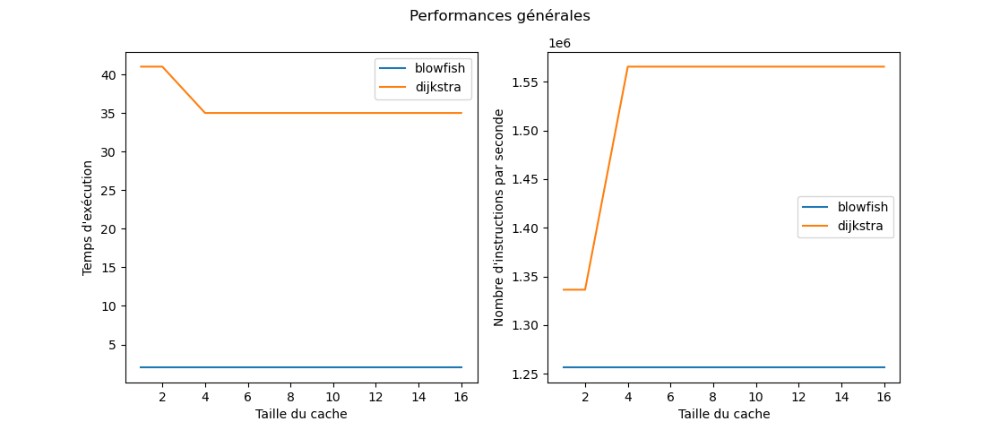

L'IPS reste inchangé selon la taille du cache pour blowfish. En revanche, on remarque que le temps d'exécution passe de 41 à 35s lorsque l'on passe de 2 à 4KB de cache pour Dijkstra et que le nombre d'instruction par seconde passe de 1,33\*10⁶ à 1,56\*10⁶. Il y a un effet de seuil car à partir des 4KB de cache, il n'y plus d'évolution de l'IPS.


Un autre indicateur des performances générales est le nombre d'instructions par cycle, car un IPC élevé indique une utilisation efficace des ressources du processeur. En traçant l'IPC en fonction de la taille du cache, on obtient la courbe suivante : 

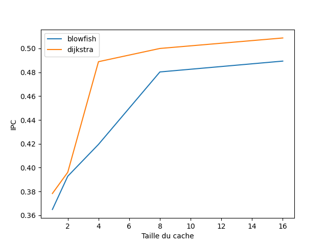

L'IPC augmente avec la taille du cache mais l'augmentation est beaucoup plus importante au début et devient nettement plus faible à partir de 4KB de cache pour Dijkstra et de 8KB pour Blowfish. 

L'augmentation de la taille du cache permet logiquement d'y stocker plus de données et permet de réduire la nécessité d'aller chercher des données dans la mémoire principale, ce qui peut réduire le temps d'inactivité des unités d'exécution du processeur et donc augmenter les performances. De plus, les principes de localité spatiale et temporelle sont d'avantage exploités car plus de données peuvent être stockées ensemble et pour un temps plus important.

Pour évaluer la hiérarchie mémoire, on va regarder le taux de miss des caches IL1, DL1 et L2. Un miss a lieu si la donnée n'est pas dans le cache et qu'il fait aller la chercher dans le processeur principal. Plus le taux de miss est bas, meilleure est la performance car un plus grand nombre d'accès mémoire est satisfait sans avoir besoin de passer par la mémoire principale, ce qui est plus lent. 

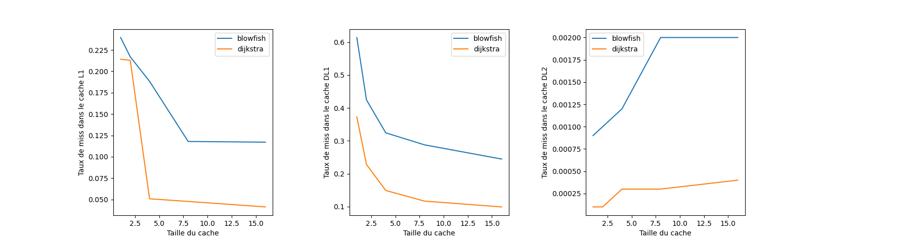

On observe que le taux de miss des caches IL1 et DL1 baissent avec leur taille, ce qui est logique car ils peuvent stocker plus d'informations qu'avant. Cela entraîne une meillleure exploitation de la localité temporelle et de la localité spatiale car plus de données peuvent être réutilisées fréquamment et être stockées ensemble. On remarque aussi que le taux de miss du cache L2 augmente alors que sa taille est constante. Cela peut venir du fait que la taille du cache L2 n'est pas adapté à la demande plus importante qui découle de l'augmentation du cache L1, ce qui peut mener à taux de miss plus important. Néanmoins, le taux de miss-rate reste très faible (~2*10⁻4 pour dijkstra et entre 10⁻3 et 10⁻2 pour blowfish).


Pour évaluer les prédictions de branchements, on utilise les taux de prédiction d'adresse et de direction. Ces deux taux vont refléter les performances des prédicteurs de branchements.

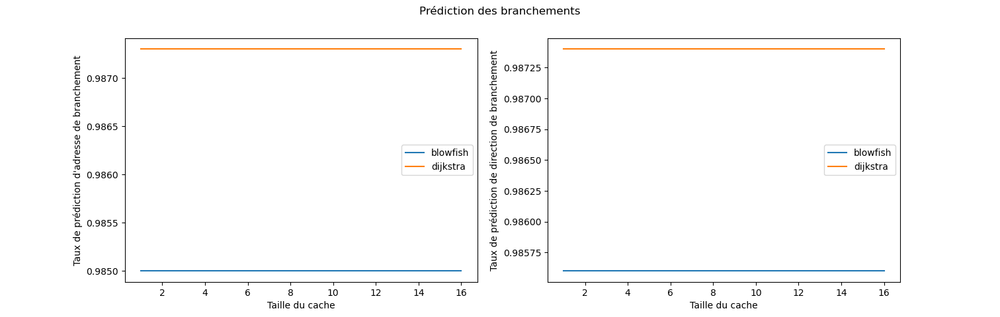

Ces taux restent inchangés même en variant les tailles des caches IL1 et DL1, ce qui est attendu car les prédicteur de branchements bimodals ne font pas appel au cache.


Globalement, l'augmentation de la taille des caches IL1 et IL2 semble augmenter les performances globlales de manière notable dans un premier temps, puis plus faiblement dans un second temps. Le seul contre coup à cette augmentation est l'augmention du miss rate du cache L2 qui reste extrêmement faible et qui est négligeable. La meilleure configuration est donc celle avec 32KB de cache de niveau 1.


### Q5 

On exécute blowfish avec la commande `sim-outorder -config config.cfg bf.ss e input_small.asc output_small.enc 1234567890abcdeffedcba098765432` et dijkstra avec la commande `sim-outorder -config config.cfg dijkstra_small.ss input.dat`. 

Le fichier config.cfg est de la forme suivante : 
`-fetch:ifqsize  8
-decode:width  4
-issue:width  8
-commit:width  4
-ruu:size  16
-lsq:size  16
-res:ialu  5
-res:fpalu  1
-res:imult  1
-res:fpmult  1
-bpred  2lev
-bpred:bimod 256
-cache:dl1  dl1:32:64:2:l
-cache:il1  il1:32:64:2:l
-cache:il2  dl2:512:64:16:l
`

En gardant les mêmes critères qu'à la question précédente, on obtient les graphes suivants : 

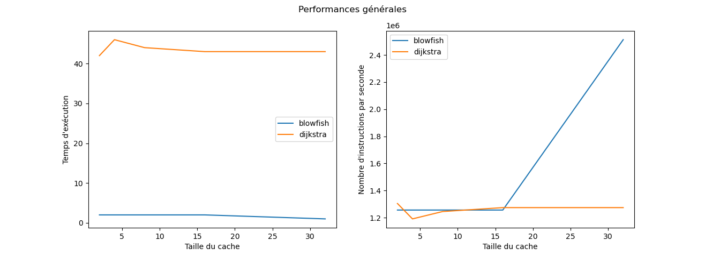

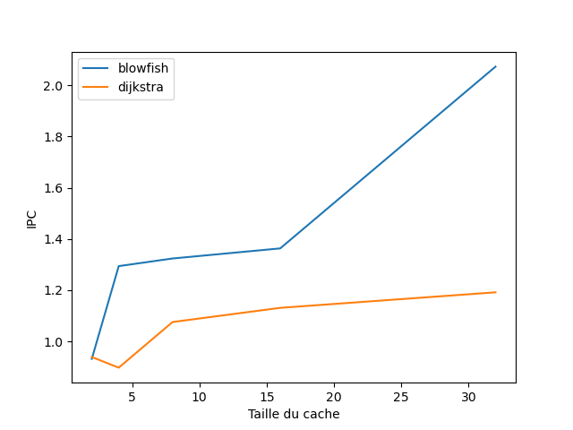

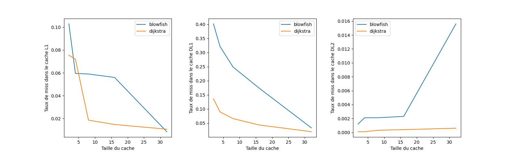

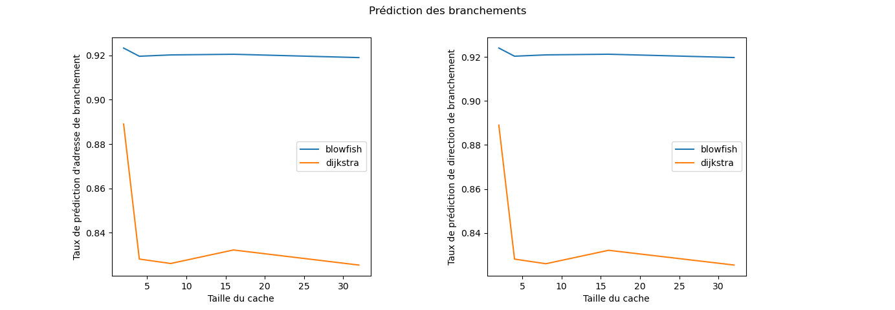

Pour Dijkstra, l'IPS est relativement constant entre les différentes tailles de cache et l'IPC augmente avec la taille des caches. Le taux de miss des caches IL1 et DL1 est décroissant de manière logarithmique tandis que le taux de miss du cache L2 augmente légèrement tout en restant très faible. 

En revanche et à la différence de la question précédente, les taux de prédictions de mémoire et d'adresse des branchements baisse drastiquement dans le passage de 2KB à 4KB avant de se stabiliser aux alentours de 82 %, avec un pic à 83% pour une taille de 16KB. Ce résultat est innatendu car un prédicteur 2-level devrait avoir de meilleure performance avec l'augmentation du cache.

La taille idéale semble donc être de 16KB car elle limite la baisee du taux de prédiction de branchement et l'augmentation du taux de miss du cache L2 tout en profitant de l'augmentation drastique de l'IPC et de l'IPS et la baisse du taux de miss pour les caches IL1 et DL1. 


Pour Blowfish, l'IPS augmente énormement avec la taille du cache, doublant en passant de 2KB à 32KB de taille de cache. De la même manière, l'IPC est doublée passant de 1 à 2. Le taux de miss des caches IL1 et DL1 décroit largement et inversement, celui du cache L2 est multiplié par 8 entre 16KB et 32KB même s'il reste faible, atteignant 1,6% à son maximum. 

Comme précédemment, on observe un baisse du taux de prédiction des branchements dans le passage de 2KB à 4KB qui est néanmoins beaucoup plus faible que pour Dijkstra. Encore une fois, on ne sait pas expliquer ce phénomène. 

La taille idéal est de 32KB car l'augmentation de l'IPC et de l'IPS entre 16KB et 32KB l'emporte sur l'augmentation du taux de miss du cache L2.


## 3. Efficacité surfacique

### Q6
Cacti6.5 est déjà installé sur salle, mais on récupère quand même l'archive pour l'exemple de fichier de configuration 'cache.cfg'  
`wget "https://hpl.hp.com/research/cacti/cacti65.tgz" --no-check-certificate `

Les valeurs qui y sont utilisées sont :
- Une taille de cache de 128Mio
- Une taille de bloc de 64o
- Une associativité de 1
- Une technologie par défaut de 0.032µm


### Q7

Pour chaque processeur et chaque cache, on crée un fichier de configuration correspondant aux données de l'énoncé :  
En indiquant la taille de la mémoire, taille de bloc, associativité, et qu'il s'agit dune mémoire de type 'cache' et non 'main memory' comme par défaut.  

On laisse les autres paramètres comme dans l'exemple, y compris la technologie par défaut de 0.032µm, puisque cacti6.5 ne supporte pas le 0.028µm.  

On somme les valeurs d'aire des sections 'Data array' et 'Tag array' récupèrées dans le texte emis par cacti.  
Connaissant l'aire d'un processeur avec ses deux L1 fournie par l'énoncé, et celle d'un cache L1 que l'on vient de de calculer, on peut alors déterminer l'aire du processeur seul.  

> --- Processeur Cortex A7 ---  
> Surface processeur sans caches : 0.3731mm²  
> Surface de chaque cache L1 : 0.03843mm²  
> Surface du cache L2 : 0.4457mm²  
> Les caches L1 occupent : 17.08% de l'ensemble coeur + caches L1  
> Surface totale : 0.8957mm²  

> --- Processeur Cortex A15 ---  
> Surface processeur sans caches : 1.93mm²  
> Surface de chaque cache L1 : 0.0346mm²  
> Surface du cache L2 : 0.399mm²  
> Les caches L1 occupent 3.46% de l'ensemble coeur + caches L1  
> Surface totale : 2.399mm²  

### Q8

Pour chaque taille de cache, on édite le fichier configuration avec la nouvelle valeur et on répète l'opération précedente.  
Résultat : la surface de l'ensemple processeur + deux L1 + L2 évolue de manière négligeable avec la capacité des caches L1.  

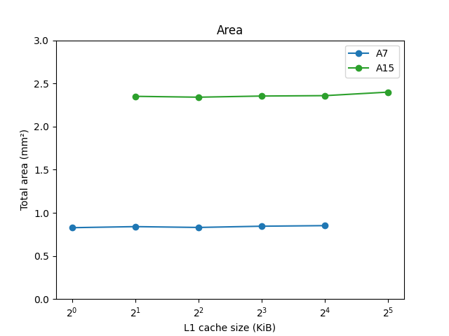

### Q9

Avec les valeur de CPI calculées à la partie 2 pour Dijkstra et Blowfish, on trace l'efficacité surfacique.  
Avec pour seuls critères la surface et le CPI, on gagne à augmenter la capacité des caches L1.  

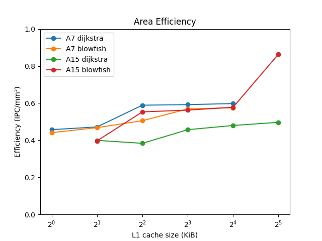


## 4. Efficacité énergétique

### Q10

La puissance consommée en continu par le processeur est de  
* Pour la A7 : 1.0 GHz × 0.10 mW/MHz = 100 mW  
* Pour le A15 : 2.5 GHz × 0.20 mW/MHz = 500 mW  

### Q11

Cacti nous fournit beaucoup de données concernant des durées des énergies et des puissances.  
Mais sans aucune documentation, difficile de savoir si telle consommation est une moyenne sur toute la durée d'allumage de la mémoire ou seulement sur le temps d'accès, ou encore quelles valeurs s'additionnent et lesquelles sont déjà comptées dans une autre...  

`Data array: Total dynamic read energy/access  (nJ): ...`  
`Tag array:  Total dynamic read energy/access (nJ): ...`  

Par dépit, on va considérer que ces deux lignes correspondent aux valeurs moyennes pour un accès mémoire, et on ne distinguera pas lecture et écriture.  
On récupère également les durées d'accès qui permettent de calculer la puissance consommé par le tableau des données et par celui des tags.  
On somme ces deux valeurs pour trouver la puissance totale consommée par le cache, en considérant que toutes les sources de pertes sont incluses.  

La puissance totale consommée par l'ensemble processeur + caches L1 + cache L2 sera :  
P_proc + (1 + p_rw) × P_L1 + (miss_IL1 + p_rw × miss_DL1) × P_L2  

Où P_proc est la valeur calculée en Q10, et P_L1 celle déterminée juste avant avec cacti, pondérée par la proportion de lectures et écritures parmi toutes les instructions, déterminée en Q1.  
Le cache IL1 est sollicité en continu, pour chaque instruction, et DL1 seulement p_rw du temps ; le cache L2 est sollicité seulement en cas de miss des caches IL1 et DL1, qui ont des miss rates distincts, calculés en partie 2.  
Avec des informations sur la RAM, on pourrait aussi prendre en compte son utilisation, avec le miss rate du cache L2.  


Pour Blowfish : p_rw = 22.21% + 3.27% = 25.48%  
Pour Dijkstra : p_rw = 24.08% + 10.32% = 34.4%  

On aurait pu détailler plus en distinguant la puissance consommée par une lecture et par une écriture.  

> --- Processeur Cortex A7 ---  
> Puissance processeur sans caches : 100.0mW  
> Puissance de chaque cache L1 : 46.79mW  
> Puissance du cache L2 : 311.4mW  

> --- Processeur Cortex A15 ---  
> Puissance processeur sans caches : 500.0mW  
> Puissance de chaque cache L1 : 43.05mW  
> Puissance du cache L2 : 305.7mW  

On trace également les efficacités énergétiques pour chaque processeur et chacun des programmes :  

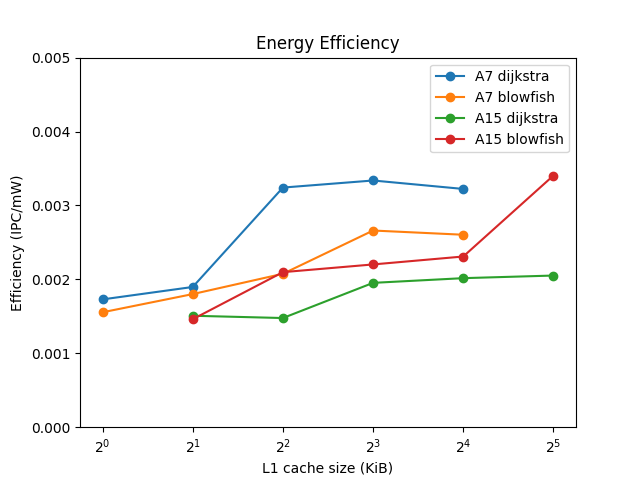


## 5. Architecture système big.LITTLE

### Q12

Pour chacun des programmes dijkstra et blowfish séparément, on cherche à déterminer la meilleure taille de caches L1 de chaque processeur.  
Les deux critères à optimiser sont l'efficacité surfacique et l'efficacité énergétique.  

- Pour le A15, Dijkstra et Blowfish :  
    Les deux efficacités sont maximales pour une valeur de cache de 32Kio  

- Pour le A7, Dijkstra et Blowfish :  
    L'efficacité surfacique et énergétique sont maximales pour 16Kio et 8Kio respectivement  

À chaque fois, la surface est légèrement meilleure pour 16Kio que 8Kio, et l'énergie légèrement meilleure pour 8Kio que 16Kio.  
La différence est très faible, et on choisira de privilégier le critère de l'énergie, qui semble plus important.  

Les valeurs optimales de taille de cache sont donc identique pour les deux applications :  
32Kio pour le processeur A15 sans ambiguité, et 8Kio pour le A7.  
