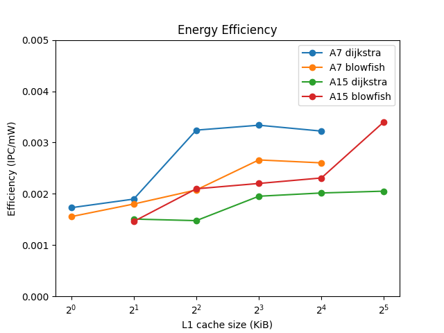

Pour les parties 3 et 4, l'exécution des commandes, l'extraction des données, et l'édition des tailles du cache L1 sont automatisées dans le script 'prog.py'  
Certains calculs et la génération des graphiques se trouvent dans 'graphes.py'  

# 3. Efficacité surfacique

### Q6
Cacti6.5 est déjà installé sur salle, mais on récupère quand même l'archive pour l'exemple de fichier de configuration 'cache.cfg'  
`wget "https://hpl.hp.com/research/cacti/cacti65.tgz" --no-check-certificate `

Les valeurs qui y sont utilisées sont :
- Une taille de cache de 128Mio
- Une taille de bloc de 64o
- Une associativité de 1
- Une technologie par défaut de 0.032µm

### Q7

Pour chaque processeur et chaque cache, on crée un fichier de configuration correspondant aux données de l'énoncé :  
En indiquant la taille de la mémoire, taille de bloc, associativité, et qu'il s'agit dune mémoire de type 'cache' et non 'main memory' comme par défaut.  

On laisse les autres paramètres comme dans l'exemple, y compris la technologie par défaut de 0.032µm, puisque cacti6.5 ne supporte pas le 0.028µm.  

On somme les valeurs d'aire des sections 'Data array' et 'Tag array' récupèrées dans le texte emis par cacti.  
Connaissant l'aire d'un processeur avec ses deux L1 fournie par l'énoncé, et celle d'un cache L1 que l'on vient de de calculer, on peut alors déterminer l'aire du processeur seul.  

> --- Processeur Cortex A7 ---  
> Surface processeur sans caches : 0.3731mm²  
> Surface de chaque cache L1 : 0.03843mm²  
> Surface du cache L2 : 0.4457mm²  
> Les caches L1 occupent : 17.08% de l'ensemble coeur + caches L1  
> Surface totale : 0.8957mm²  

> --- Processeur Cortex A15 ---  
> Surface processeur sans caches : 1.93mm²  
> Surface de chaque cache L1 : 0.0346mm²  
> Surface du cache L2 : 0.399mm²  
> Les caches L1 occupent 3.46% de l'ensemble coeur + caches L1  
> Surface totale : 2.399mm²  

### Q8

Pour chaque taille de cache, on édite le fichier configuration avec la nouvelle valeur et on répète l'opération précedente.  
Résultat : la surface de l'ensemple processeur + deux L1 + L2 évolue de manière négligeable avec la capacité des caches L1.  

### Q9

Avec les valeur de CPI calculées à la partie 2 pour Dijkstra et Blowfish, on trace l'efficacité surfacique.  
Avec pour seuls critères la surface et le CPI, on gagne à augmenter la capacité des caches L1.  

# 4. Efficacité énergétique

### Q10

La puissance consommée en continu par le processeur est de  
* Pour la A7 : 1.0 GHz * 0.10 mW/MHz = 100 mW  
* Pour le A15 : 2.5 GHz * 0.20 mW/MHz = 500 mW  

### Q11

Cacti nous fournit beaucoup de données concernant des durées des énergies et des puissances.  
Mais sans aucune documentation, difficile de savoir si telle consomation est une moyenne sur toute la durée d'allumage de la mémoire ou seulement durant l'accès, ou encore quelles valeur s'additionnent et lesquelles sont déjà comptées dans une autre...  

`Data array: Total dynamic read energy/access  (nJ): ...`  
`Tag array:  Total dynamic read energy/access (nJ): ...`  

Par dépit, on va considérer que ces deux lignes correspondent aux valeurs moyennes pour un accès mémoire, et on ne distinguera pas lecture et écriture.  
On récupère également les durées d'accès qui permettent de calculer la puissance consommé par le tableau des données et par celui des tags.  
On somme ces deux valeurs pour trouver la puissance totale consommée par le cache, en considérant que toutes les sources de pertes sont incluses.  

La puissance totale consommée par l'ensemble processeur + caches L1 sera : P_proc + 2 * P_L1 * p_rw  
Où P_proc est la valeur calculée en Q10, et P_L1 celle déterminée avec cacti, pondrée par la proportion de lectures et écritures parmi toutes les instrucions, déterminée en Q1.  

Pour Blowfish, p_rw = 22.21% + 3.27% = 25.48%  
Pour Dijkstra, p_rw = 24.08% + 10.32% = 34.4%  

On aurait pu préciser plus en distinguant la puissance consomée par une lecture ou une écriture.  

> --- Processeur Cortex A7 ---  
> Puissance processeur sans caches : 100.0mW  
> Puissance de chaque cache L1 : 46.79mW  
> Puissance du cache L2 : 311.4mW  
> Puissance totale (hors L1): 193.6mW  

> --- Processeur Cortex A15 ---  
> Puissance processeur sans caches : 500.0mW  
> Puissance de chaque cache L1 : 43.05mW  
> Puissance du cache L2 : 305.7mW  
> Puissance totale (hors L1): 586.1mW  

On trace également les efficacités énergétiques pour chaque processeur et chacun des programmes :  

