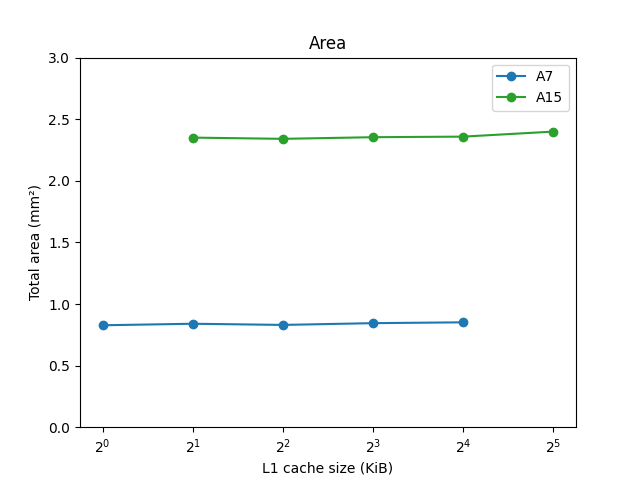

# 3. Efficacité surfacique

### Q6
Cacti6.5 est déjà installé sur salle, mai on récupère quand même l'archive pour l'exemple de fichier de configuration 'cache.cfg'
`wget "https://hpl.hp.com/research/cacti/cacti65.tgz" --no-check-certificate `

Les valeurs qui y sont utilisées sont :
- Une taille de cache de 128Mio
- Une taille de bloc de 64o
- Une associativité de 1
- Une technologie par défaut de 0.032µm

### Q7

Pour chaque processeur et chaque cache, on crée un fichier de configuration correspondant aux données de l'énoncé :  
En indiquant la taille de la mémoire, taille de bloc, associativité, et qu'il s'agit dune mémoire de type 'cache' et non 'main memory' comme par défaut.  

On laisse les autres paramètres comme dans l'exemple, y compris la technologie par défaut de 0.032µm, puisque cacti6.5 ne supporte pas le 0.028µm.  

On somme les valeurs d'aire des sections 'Data array' et 'Tag array' récupèrées dans le texte emis par cacti.  
Connaissant l'aire d'un processeur avec ses deux L1 fournie par l'énoncé, et celle d'un cache L1 que l'on vient de de calculer, on peut alors déterminer l'aire du processeur seul.  

 --- Processeur Cortex A7  ---  
Surface processeur sans caches : 0.373mm²  
Surface de chaque cache L1 : 0.0384mm²  
Surface du cache L2 : 0.446mm²  
Les caches L1 occupent 17.1% de l'ensemble coeur + caches L1  

--- Processeur Cortex A15  ---  
Surface processeur sans caches : 1.93mm²  
Surface de chaque cache L1 : 0.0346mm²  
Surface du cache L2 : 0.399mm²  
Les caches L1 occupent 3.5% de l'ensemble coeur + caches L1  

### Q8

Pour chaque taille de cache, on édite le fichier configuration avec la nouvelle valeur et on répète l'opération précedente  
Résultat : la surface de l'ensemple processeur + deux L1 + L2 évolue de manière négligeable avec la capacité des caches L1.  

[]

### Q9

Avec les valeur de CPI calculées à la partie 2 pour Blowfish, on trace l'efficacité surfacique.  
Avec pour seuls critères la surface et le CPI, on gagne à augmenter la capacité des caches L1.  

[]