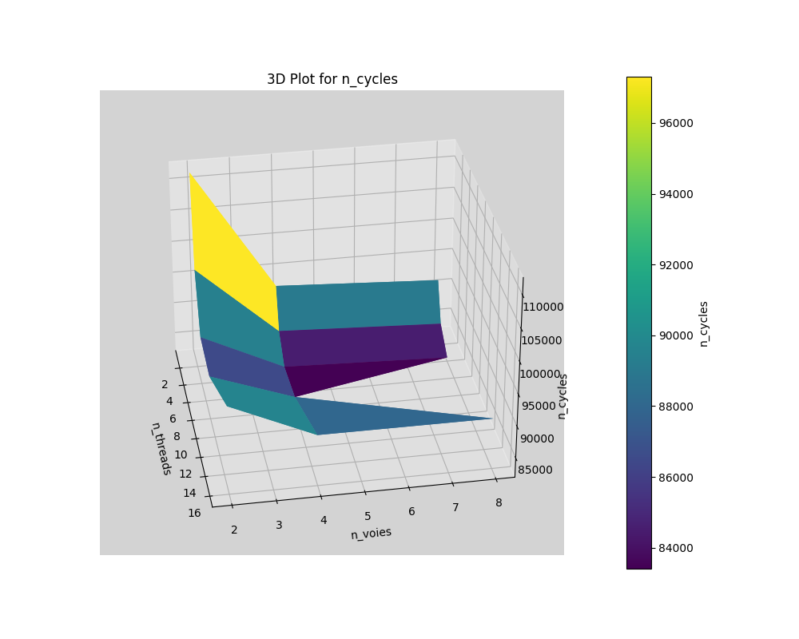
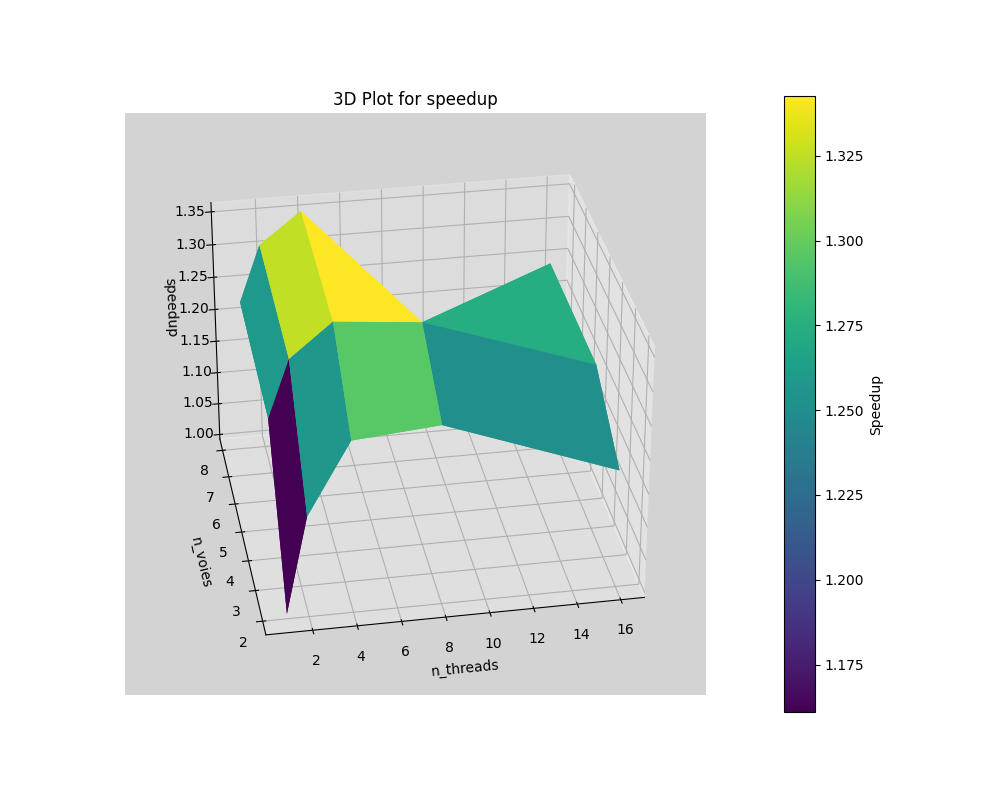
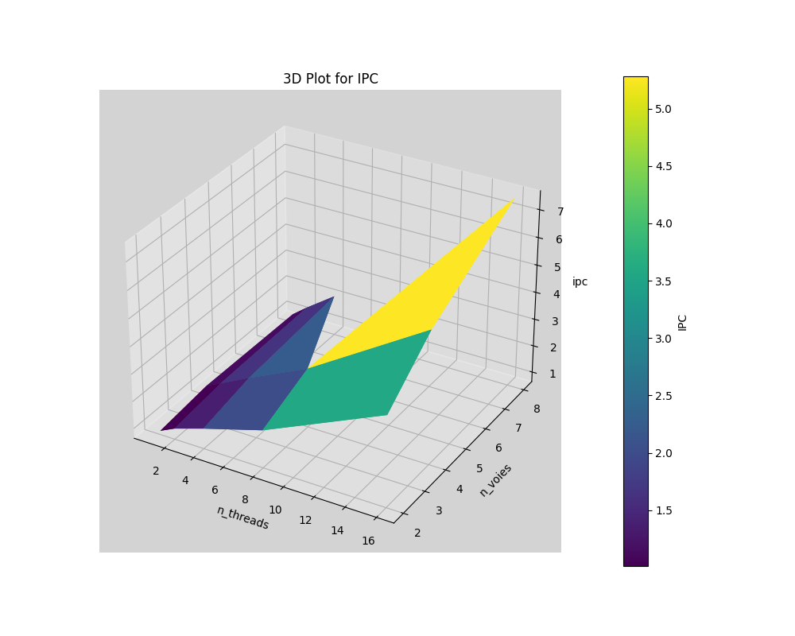

# Partie 4

sudo ssh -tX fabien.girard@ssh.ensta.fr salle

$GEM5/build/ARM/gem5.fast $GEM5/configs/example/se.py -c $GEM5/tests/test-progs/hello/bin/arm/linux/hello

## Q9

```
~/Code/ES201/tp5$ $GEM5/build/ARM/gem5.fast $GEM5/configs/example/se.py --cpu-type detailed -n $N -w $W --caches -c test_omp -o "$N 16"
```

Pour une raison inconnue, la simulation avec 8 threads et 8 voies entraine une segmentation fault, d'où l'abscence de points à cet endroit dans le graphe suivant :




## Q10

$Speedup = \dfrac{n_{cycles}(1\;thread, 2\;voies)}{n_{cycles}}$



## Q11

$IPC_{max} = \dfrac{n_{instructions}}{n_{cycles}}$




## Q12

On remarque une augmentation significative du speedup lorsqu'on double le nombre de voies, suivi d'une augmentation moins marquée lorsqu'on double à nouveau ce nombre. Il est raisonnable de supposer que toute augmentation ultérieure serait moins efficace, ce qui s'explique par le fait que, comme vu en cours, le nombre de voies dépasse rarement 8 en pratique. Ce phénomène résulte en partie de l'augmentation des aléas tels que le contrôle, les données et les dépendances, qui se multiplient avec l'élargissement du superscalaire. De plus, la complexité architecturale induite par cette largeur limite la valeur pratique de celle-ci.  

Par ailleurs, on constate que la largeur du processeur superscalaire permet d'augmenter l'IPC d'autant plus que le nombre de threads augmente. On peut expliquer cela en considérant le parallélisme au niveau du processeur. En augmentant la largeur du superscalaire, le processeur peut exécuter un plus grand nombre d'instructions en parallèle. Lorsque le nombre de threads augmente également, chaque thread bénéficie de cette capacité accrue d'exécution parallèle.  

Enfin, on observe que l'augmentation du nombre de threads ne semble pas améliorer le speedup au-delà de 8. Pire, elle le diminue légèrement. Cette diminution s'explique par le fait qu'au-delà d'un certain nombre de threads, le temps consacré à la communication (échange de données ou simple synchronisation) devient exponentiellement plus long. Cela est corroboré par le fait que l'IPC augmente linéairement en fonction du nombre de threads. Autrement dit, bien que l'on exécute davantage d'instructions par cycle, la vitesse globale ne s'améliore pas, indiquant que bon nombre de ces instructions sont dédiées à la communication et ne contribuent pas à la résolution du problème.  
