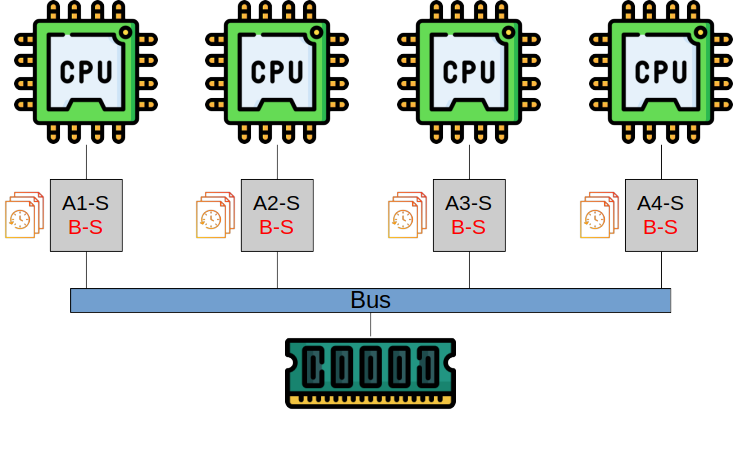
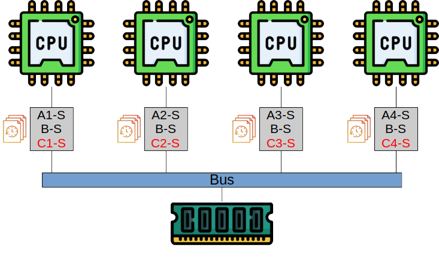
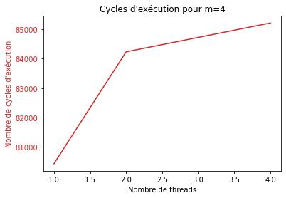
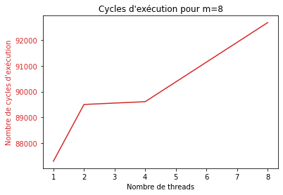
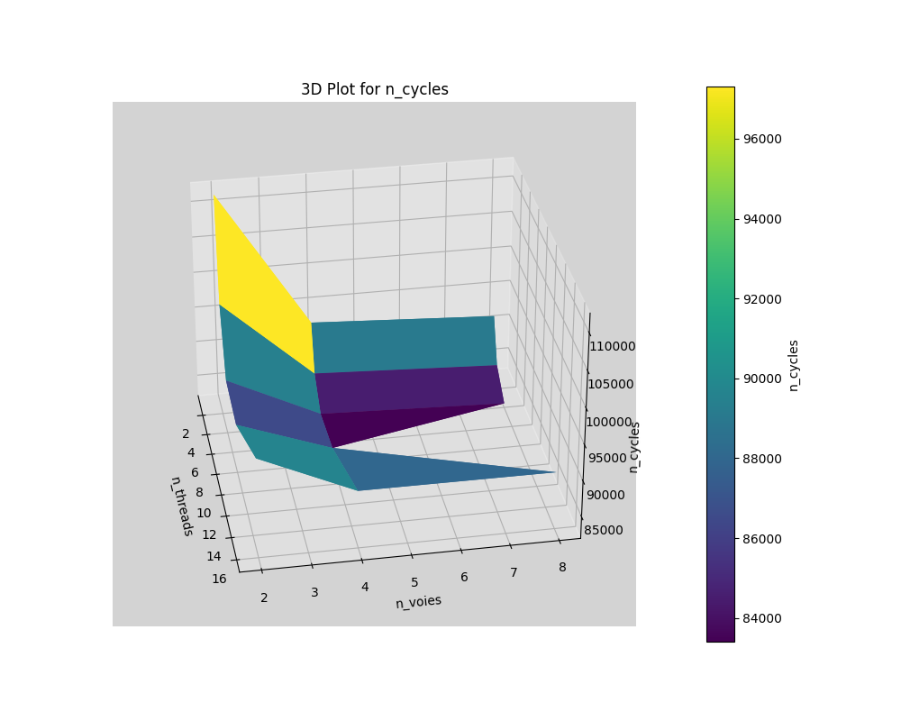
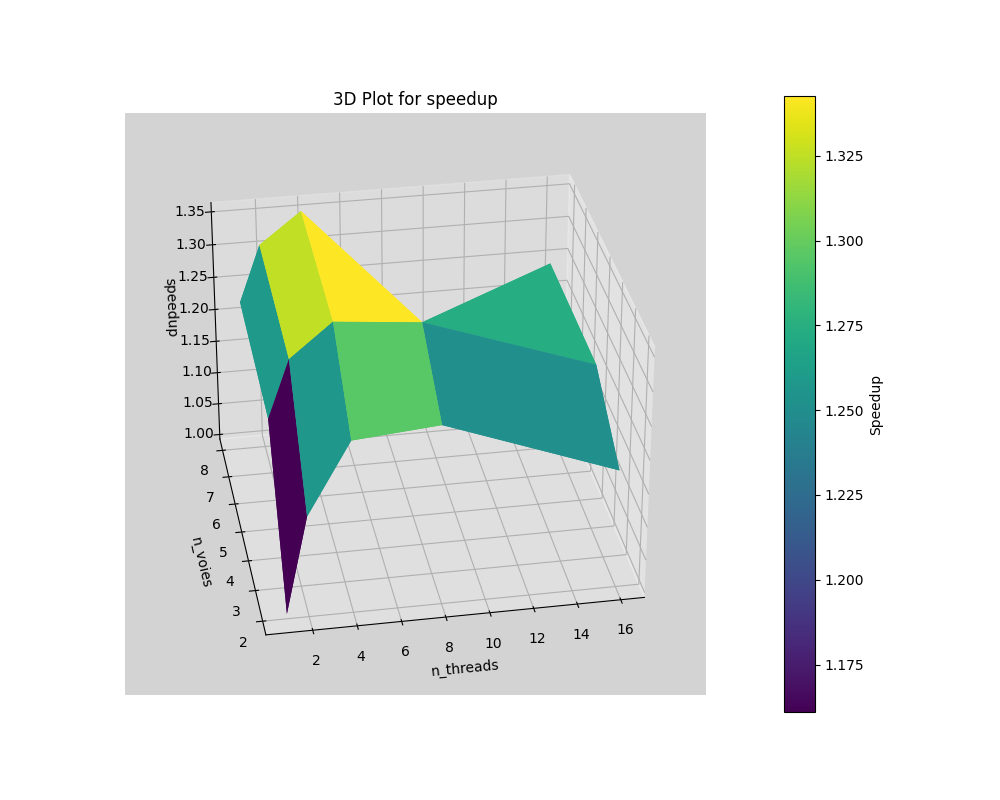
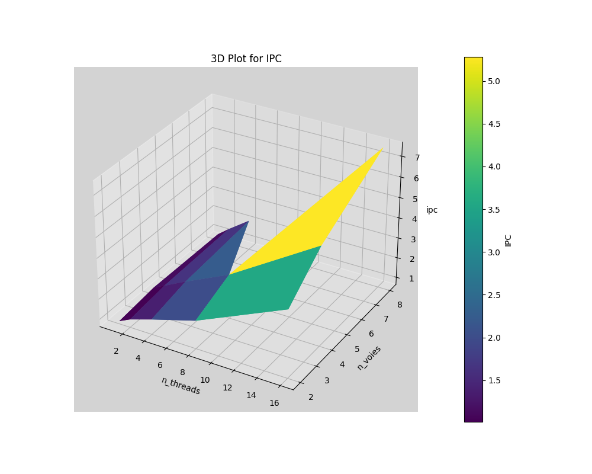

# TP5

## Analyse théorique de cohérence de cache

### Q1

On suppose que les matrices sont de dimensions $n*n$ où $n = k*m$.

- Pi récupère les lignes de A suivantes : i, m+i, ..., (k-1)*m + i -> shared


- Tous les processeurs récupèrent B -> shared



- Pi écrit sur les lignes de C suivantes : i, m+i, ..., (k-1)*m + i -> modified, mais les autres ne les avaient pas, donc pas de invalid




## Paramètres de l'architecture multicœurs

### Q2 

| Paramètre      | Valeur par défaut |
| -------------- | ------------------ |
| fetchQueueSize | 32                 |
| decodeWidth    | 8                  |
| issueWidth     | 8                  |
| commitWidth    | 8                  |
| LQEntries      | 32                 |
| SQEntries      | 32                 |

### Q3

| Cache   | Paramètre       | Valeur par défaut   |
| ------- | --------------- | -------------------- |
| IL1     | Associativité   | 2                    |
|         | Taille          | 32KB                 |
|         | Taille ligne    | 64                   |
| ------- | --------------- | -------------------- |
| DL1     | Associativité   | 2                    |
|         | Taille          | 64KB                 |
|         | Taille ligne    | 64                   |
| ------- | --------------- | -------------------- |
| L2      | Associativité   | 8                    |
|         | Taille          | 2MB                  |
|         | Taille ligne    | 64                   |


## Architecture multicoeurs avec des processeurs superscalaires in-order (Cortex A7)

On se propose dans cette partie d’étudier une architecture multiprocesseur de type CMP à base de cœurs équivalents au Cortex A7 étudié dans le TP4. Dans notre simulateur gem5, le modèle de CPU associé à ce type de processeur est le modèle **arm_detailed** (--cpu-type=arm_detailed).

### Q4

Pour trouver le processeur exécutant toujours le plus grand nombre de cycles, on va réaliser notre simulation en fixant la taille **m** de la matrice et en faisant varier le nombre de threads parallèles de l'application, sans oublier qu'ici on a **n=ncores=nthreads**. 
On utilise donc les lignes de commande :  
```
$GEM5/build/ARM/gem5.fast $GEM5/configs/example/se.py --cpu-type arm_detailed --caches -n n -c test_omp -o "n m"
nano m5out/stats.txt
```

Pour m = 4 :

| n | sim_insts | max cpu.numCycles |
|---|-----------|-------------------|
| 1 | 16577     | cpu : 80432       |
| 2 | 29651     | cpu0 : 84230      |
| 4 | 54655     | cpu0 : 85210      |

Pour m = 8 :

| n | sim_insts | max cpu.numCycles |
|---|-----------|-------------------|
| 1 | 25255     | cpu : 87302       |
| 2 | 38281     | cpu0 : 89502      |
| 4 | 64719     | cpu0 : 89610      |
| 8 | 123166    | cpu0 : 92672      |

Pour m = 16 :

| n | sim_insts | max cpu.numCycles |
|---|-----------|-------------------|
| 1 | 86730     | cpu : 127718      |
| 2 | 100012    | cpu0 : 115372     |
| 4 | 124108    | cpu0 : 107704     |
| 8 | 187864    | cpu0 : 107698     |

n=16 -> Erreur de segmentation (core dumped)

Pour m = 32 :

| n | sim_insts | max cpu.numCycles |
|---|-----------|-------------------|
| 1 | 547019    | cpu : 382072      |
| 2 | 562625    | cpu0 : 264216     |
| 4 | 588863    | cpu0 : 203618     |

n=8 -> Erreur de segmentation (core dumped)

Quelque soit la taille de la matrice, et le nombre de thread, c'est toujours le processeur de rang 0 qui effectue le plus grand nombre de cycles. 
En effet, c'est le thread principal et donc le processeur de rang 0 qui attend la fin de l'exécution de tous les threads secondaires pour considérer que la multiplication des matrices a réussi. 


### Q5
D'après les résultats de la question 5 : 





### Q6

Pour calculer le speed up, on calcule :
$S(n)=\frac{numCycles(n=1)}{maxNumCycles(n)}$

Pour m = 4 : numCycles(n=1) = 80432

| n | Speed-up |
|---|----------|
| 2 | 0,95491  | 
| 4 | 0,94393  |

Pour m = 8 : numCycles(n=1) = 87302

| n | Speed-up |
|---|----------|
| 2 | 0,97542  |
| 4 | 0,97424  |
| 8 | 0,94205  |

Pour m = 16 : numCycles(n=1) = 127718

| n | Speed-up |
|---|----------|
| 2 | 1,107010 |
| 4 | 1,185824 |
| 8 | 1,185890 |

n=16 -> Erreur de segmentation (core dumped)

Pour m = 32 : numCycles(n=1) = 382072

| n | Speed-up |
|---|----------|
| 2 | 1,446059 |
| 4 | 1,876416 |

n=8 -> Erreur de segmentation (core dumped)


### Q7 
La valeur maximale de l'IPC s'obtient en calculant : 
$IPC_{max}=\frac{simInstructions}{maxNumCycles}$

Pour m = 4 :

| n | IPC     |
|---| --------|
| 1 | 0,20610 |
| 2 | 0,35202 |
| 4 | 0,64142 |

Pour m = 8 :

| n | IPC     |
|---|---------|
| 1 | 0,28293 |
| 2 | 0,42771 |
| 4 | 0,72222 |
| 8 | 1,32905 |

Pour m = 16 :

| n | IPC      |
|---|----------|
| 1 | 0,679074 |
| 2 | 0,866865 |
| 4 | 1,152306 |
| 8 | 1,744358 |

n=16 -> Erreur de segmentation (core dumped)

Pour m = 32 :

| n | IPC      |
|---|----------|
| 1 | 1,431717 |
| 2 | 2,129413 |
| 4 | 2,891998 |

n=8 -> Erreur de segmentation (core dumped)

### Q8 
Les données du speed-up sont assez intéressantes : 

-> pour $m \leq 8$, le speed-up est inférieur à un et diminue avec l'augmentation du nombre de thread. Ainsi, pour de petites matrices, la simulation montre qu'il n'est pas nécessaire d'utiliser plusieurs processeurs et au contraire, cela diminue la performance de notre programme.

-> pour $m>16$, le speed-up est supérieur à un et augmente avec l'augmentation du nombre de thread

De plus, peu importe la taille de la matrice, l'IPC augmente avec le nombre de thread ce qui est logique car plus il y a de thread, plus il y a d'instructions effectuées à chaque coup d'horloge.

Ainsi plus une matrice assez grande, plus on gagne en performance si on augmente le nombre de thread. Cependant, il faut bien prévoir la place dans la mémoire car nous n'avons pas pu faire un certain nombre de calcul (notemment pour $m \geq 64$) à cause d'une erreur de segmentation.


# Partie 4

## Q9

On exécutera le code suivant, en faisant varier $N et $W dans un script :
```
~/Code/ES201/tp5$ $GEM5/build/ARM/gem5.fast $GEM5/configs/example/se.py --cpu-type detailed -n $N -w $W --caches -c test_omp -o "$N 16"
```

Pour une raison inconnue, la simulation avec 8 threads et 8 voies entraine une segmentation fault, d'où l'abscence de points à cet endroit dans le graphe obtenu :




## Q10

$Speedup = \dfrac{n_{cycles}(1\;thread, 2\;voies)}{n_{cycles}(\$N, \$M)}$



## Q11

$IPC_{max} = \dfrac{n_{instructions}}{n_{cycles}}$




## Q12

On remarque une augmentation significative du speedup lorsqu'on double le nombre de voies, suivi d'une augmentation moins marquée lorsqu'on double à nouveau ce nombre. Il est raisonnable de supposer que toute augmentation ultérieure serait moins efficace, ce qui s'explique par le fait que, comme vu en cours, le nombre de voies dépasse rarement 8 en pratique. Ce phénomène résulte en partie de l'augmentation des aléas tels que le contrôle, les données et les dépendances, qui se multiplient avec l'élargissement du superscalaire. De plus, la complexité architecturale induite par cette largeur limite la valeur pratique de celle-ci.  

Par ailleurs, on constate que la largeur du processeur superscalaire permet d'augmenter l'IPC d'autant plus que le nombre de threads augmente. On peut expliquer cela en considérant le parallélisme au niveau du processeur. En augmentant la largeur du superscalaire, le processeur peut exécuter un plus grand nombre d'instructions en parallèle. Lorsque le nombre de threads augmente également, chaque thread bénéficie de cette capacité accrue d'exécution parallèle.  

Enfin, on observe que l'augmentation du nombre de threads ne semble pas améliorer le speedup au-delà de 8. Pire, elle le diminue légèrement. Cette diminution s'explique par le fait qu'au-delà d'un certain nombre de threads, le temps consacré à la communication (échange de données ou simple synchronisation) devient exponentiellement plus long. Cela est corroboré par le fait que l'IPC augmente linéairement en fonction du nombre de threads. Autrement dit, bien que l'on exécute davantage d'instructions par cycle, la vitesse globale ne s'améliore pas, indiquant que bon nombre de ces instructions sont dédiées à la communication et ne contribuent pas à la résolution du problème.  


